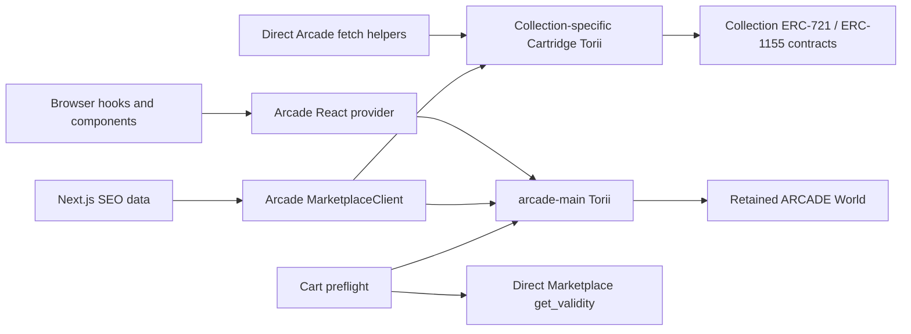
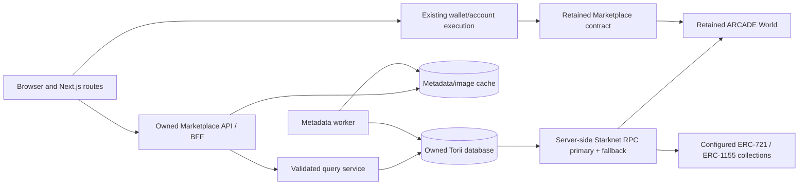

# Marketplace Indexer Replacement Scope — Existing Contracts Retained

Status: Proposed

Date: July 11, 2026

Target: `BibliothecaDAO/marketplace`

Decision under review: replace Cartridge-hosted marketplace indexing, token indexing, metadata delivery, and frontend read clients while retaining the currently deployed Arcade World and Marketplace contracts.

This is the retained-contract alternative to the broader [`MARKETPLACE-INFRA-MIGRATION-SCOPE.md`](./MARKETPLACE-INFRA-MIGRATION-SCOPE.md).

> **Immediate operational context:** On July 11, 2026, the pinned SDK's default `https://api.cartridge.gg/x/arcade-main/torii` endpoint and its `/graphql` and `/sql` paths returned HTTP 410. The retained mainnet World and Marketplace contracts still resolved at their expected addresses and class hashes. The first deliverable is therefore a deterministic chain replay, not a frontend endpoint toggle.

## 1. Executive decision

Keeping the contracts and replacing only the read infrastructure is technically viable and is the recommended reduced scope if the team accepts the retained contract's behavior and risks.

The target is:

1. One Bibliotheca-operated Torii deployment per supported chain, initially pinned to a version proven compatible with the Arcade Dojo 1.8-era World.
2. The retained `ARCADE` World indexed for current `Book` and `Order` model state plus `Listing`, `Offer`, and `Sale` event messages.
3. Every product collection indexed as an external ERC-721 or ERC-1155 contract in that same per-chain data plane, producing tokens, balances, metadata, and traits.
4. A versioned Bibliotheca read API/BFF in front of Torii. Browsers do not receive raw SQL access.
5. A project-owned TypeScript gateway and domain types replacing Arcade's hosted-data functions and React read provider.
6. Existing wallet connections, contract addresses, order keys, approvals, listings, offers, and transaction calldata remain unchanged.
7. Shadow replay and reconciliation precede the read cutover. Rollback affects reads only and never changes contract state.

This removes the unavailable hosted indexer without requiring users to relist, recreate offers, or approve a new contract.

### Recommended implementation choice

Use self-hosted Torii first, rather than writing a custom Starknet event indexer.

The retained contract is a Dojo World application. Torii natively discovers Dojo model registration and model mutations, which matters because a marketplace cancellation updates the `ARCADE-Order` model without emitting a dedicated cancellation event. A generic event-only consumer can miss cancellations unless it also decodes World model writes.

Do not expose Torii directly as the product API. Torii remains rebuildable indexing infrastructure; the BFF owns stable schemas, pagination, validation, caching, observability, and future indexer portability.

### Contract-risk acceptance

An indexer migration does not change or remediate on-chain behavior. Approval of this plan therefore accepts, or separately mitigates in the client, the retained protocol characteristics identified in the broader review:

- the minimum order lifetime is eight hours;
- ERC-721 orders use the contract's zero-quantity sentinel;
- offer creation requires ERC-20 balance and allowance;
- the contract accepts arbitrary non-zero ERC-20 currency addresses;
- the legacy `get_validity` helper does not check order status or global pause state;
- cancellation has no dedicated marketplace event;
- buyer-order execution accepts client-fee terms that are not committed in the maker's stored order.

The owned read layer can expose more complete status and safer warnings, but it cannot make an unsafe contract transition impossible. The fee behavior in particular requires explicit security/product sign-off if the contract remains.

## 2. Scope boundary

### 2.1 Retained unchanged

| Surface | Retained behavior |
| --- | --- |
| Mainnet Arcade World | `0x7a079295990e43441a7389fdc3b9ba063c6cd6aee16fb846f598c42a9f04ff7` |
| Mainnet Marketplace | `0x6bbf16b6c67b1bef27a187b499b2f3a14af31646c2c90d64f11b9087c3f527c` |
| Marketplace class | `0x58fcd599b5037e899a479324dc5d09d46db2640d0587a41259ef3db0c95b858` at review time |
| World first present | Mainnet block `2,407,079` in the bounded RPC history probe |
| Marketplace registration | Mainnet block `2,407,081` in the bounded RPC history probe |
| Namespace and models | `ARCADE`, `ARCADE-Book`, `ARCADE-Order` |
| Order identity | Existing `(id, collection, token_id)` key |
| Existing orders | Remain on-chain and actionable according to the retained contract |
| User approvals | Continue authorizing the same Marketplace address |
| Writes | Existing list, offer, cancel, remove, and execute ABI/call semantics |
| Atomic cart | Existing account multicall behavior |
| Wallet connectors | Controller, Ready, and Braavos remain in scope as today |
| Browser transaction RPC | Unchanged in P0 unless a separate RPC migration is approved |
| Fee and royalty rules | Retained on-chain rules; the new read layer reports rather than changes them |

Addresses are recovery anchors, not new deployment work. Revalidate configured chain, class hash, ABI hash, and World address at startup.

### 2.2 Replaced

- The hosted `arcade-main` Torii used for `Order` and `Book` reads.
- Per-collection Cartridge Torii projects used for token contracts, tokens, balances, metadata, images, and traits.
- Browser calls to Cartridge's Torii SQL, GraphQL, gRPC, or `/static` asset paths.
- `MarketplaceClientProvider` as the production read authority.
- Direct `fetchCollectionTokens`, `fetchTokenBalances`, `fetchTraitNamesSummary`, and `fetchTraitValues` calls from `@cartridge/arcade`.
- Arcade-backed server-side SEO reads.
- “Client initialized” as an operational readiness signal.
- `projectId` as a product data-routing key.

### 2.3 Explicitly out of scope

- Deploying or upgrading a marketplace contract.
- Moving or recreating listings, offers, approvals, or order IDs.
- Changing protocol/client fees, royalties, currency policy, or order duration.
- Replacing Cartridge Controller or the browser's Starknet RPC.
- Running a full Starknet node; the indexer may start with contracted RPC providers and failover.
- Redesigning marketplace screens.
- Auctions, signed off-chain orders, cross-chain settlement, or new order types.

## 3. Why an endpoint-only change is not available

The repository pins `@cartridge/arcade@0.3.14-preview.1`. Its public `MarketplaceClientConfig` accepts chain, project, runtime, image resolvers, and an optional RPC provider, but it does not accept an arbitrary Torii base URL, World address, Marketplace address, or deployment manifest.

The pinned package constructs these URLs internally:

```text
https://api.cartridge.gg/x/{project}/torii
https://api.cartridge.gg/x/{project}/torii/sql
https://api.cartridge.gg/x/{project}/torii/static/...
```

Its default order and fee project is `arcade-main`. Token and trait reads may use each collection's configured `projectId`, but order and `Book` reads always use the default project.

This repository has 18 production files and 13 test files importing `@cartridge/arcade`. Several read paths bypass the React provider entirely, including collection tokens, balances, trait facets, and server-rendered SEO. Supplying a custom client to the current provider would therefore replace only part of the dependency.

The durable cutover needs a project-owned read boundary. Retaining `ArcadeProvider` solely for the existing contract manifest, direct `get_validity` call, and write support is acceptable in this indexer-only scope, provided it cannot issue hosted Torii reads. It can be extracted later without changing the indexer architecture.

Primary evidence: the pinned [Marketplace client types](https://github.com/cartridge-gg/arcade/blob/c0355bcd142627d06fb639fd7bf3ea8b57f80d64/packages/arcade-ts/src/marketplace/types.ts), [SQL transport](https://github.com/cartridge-gg/arcade/blob/c0355bcd142627d06fb639fd7bf3ea8b57f80d64/packages/arcade-ts/src/modules/torii-sql-fetcher.ts), [chain configuration](https://github.com/cartridge-gg/arcade/blob/c0355bcd142627d06fb639fd7bf3ea8b57f80d64/packages/arcade-ts/src/configs/index.ts), and [edge client](https://github.com/cartridge-gg/arcade/blob/c0355bcd142627d06fb639fd7bf3ea8b57f80d64/packages/arcade-ts/src/marketplace/client.edge.ts).

## 4. Current read dependency inventory



| Product capability | Current indexed source | Target source |
| --- | --- | --- |
| Collection metadata and supply | Per-collection `token_contracts` | Owned API over unified Torii token index |
| Collection token pages | Per-collection `tokens` | Owned keyset-paginated token endpoint |
| Token metadata and image | Torii metadata plus hosted `/static` image | Owned metadata normalization/cache and image policy |
| Current owner / balances | Per-collection `token_balances` | Owned balance projection |
| Trait names and values | Per-collection `token_attributes` raw SQL | Owned facet endpoints |
| Orders and listings | `arcade-main` `ARCADE-Order` | Owned order projection from retained World |
| Marketplace fee config | `arcade-main` `ARCADE-Book` | Owned `Book` endpoint from retained World |
| Market activity | Current order rows and status | Owned order state plus event-message history |
| Checkout listing freshness | Hosted listing query plus direct `get_validity` | Owned placed-order query plus augmented direct-chain preflight |
| Portfolio | Hosted token balance pages | Owned account holdings endpoint |
| SEO | Server-created Arcade client | Server-side owned API client |
| Readiness | Arcade client construction | API, indexer lag, World/model, metadata, and RPC health |

### 4.1 Current Torii storage contract

The pinned edge client assumes these tables and models:

- `token_contracts`
- `tokens`
- `token_balances`
- `token_attributes`
- `ARCADE-Order`
- `ARCADE-Book`

The replacement does not need to expose these table names publicly, but replay acceptance must prove equivalent data coverage.

### 4.2 Current configuration to retire

- `NEXT_PUBLIC_MARKETPLACE_DEFAULT_PROJECT`
- `NEXT_PUBLIC_MARKETPLACE_RUNTIME`
- the `projectId` routing field in `NEXT_PUBLIC_MARKETPLACE_COLLECTIONS`

Keep collection addresses and names. During rollout, the parser may continue accepting `address|name|projectId` while ignoring the legacy project field; remove it after all environments have migrated.

## 5. Retained on-chain data model

### 5.1 World models

The indexer must reconstruct current state for:

```text
ARCADE-Book
  key: id: u32
  value: version, paused, royalties, counter, fee_num, fee_receiver

ARCADE-Order
  key: id: u32, collection: felt252, token_id: u256
  value: royalties, category, status, expiration, quantity,
         unit price, currency, owner
```

All integer and address fields must remain lossless. The product API serializes addresses, token IDs, order IDs, quantities, prices, balances, and timestamps as canonical strings. Bounded enums and basis points can be JSON integers after range validation.

### 5.2 World event messages

Index and retain immutable history for:

- `ARCADE-Listing`: new sell order snapshot and timestamp.
- `ARCADE-Offer`: new exact-token or collection buy-order snapshot and timestamp.
- `ARCADE-Sale`: executed order snapshot, from/to addresses, and timestamp.

Cancellation and invalid-order removal do not emit a dedicated marketplace event in the pinned implementation. The current `ARCADE-Order.status` model value is authoritative for those states. A successful replay must demonstrate cancelled rows even when no cancellation event exists.

If the product needs cancellation timestamps or a historical fee/pause administration trail, preserve the corresponding World model-write transaction history in an append-only audit projection. `Listing`, `Offer`, and `Sale` alone cannot provide that history.

### 5.3 External token contracts

For every configured collection, index:

- contract standard and metadata;
- token IDs and token metadata;
- ERC-721 ownership or ERC-1155 balances;
- transfer history needed to maintain current balances;
- normalized attributes used by filters;
- mint/burn effects and total supply where supported.

The upstream Arcade repository's own Torii configuration demonstrates a World plus external `ERC721:<address>` contract in one deployment. The replacement must prove the same pattern for every actual launch collection, including any ERC-1155 or non-standard metadata behavior.

### 5.4 Direct-chain reads that remain outside the indexer

- Marketplace `get_validity` / `get_validities`.
- Collection ownership, balance, and approval checks used as checkout preflight.
- ERC-20 balance/allowance where required.
- ERC-2981 `royalty_info`.
- chain head, class hash, chain ID, and transaction receipt status.

Indexed data improves browse performance but does not authorize settlement. Checkout must still fail closed on stale or incomplete data.

## 6. Target architecture



### 6.1 Ownership boundaries

- The retained World and Marketplace contract remain authoritative.
- Torii is a rebuildable projection, never transaction authority.
- The API is the stable application contract; Torii table names and version changes stay internal.
- Metadata/image availability is separated from order-safety readiness.
- The browser signs the same transactions it signs today.
- Indexer RPC credentials, database access, and reindex controls are server-only.

### 6.2 Deployment topology

Recommended P0 topology per chain:

- one Torii writer/indexer;
- persistent database volume with scheduled snapshots;
- one versioned query API, horizontally scalable if needed;
- metadata/image cache in owned object storage or hardened proxy;
- primary and fallback Starknet RPC providers;
- staging replay deployment isolated from production;
- metrics, logs, and alerts collected outside the indexer host.

Start with one unified Torii per chain rather than reproducing one hosted project per collection. Add every supported NFT contract to its external-contract list. Split workloads only if replay, database size, query contention, or collection-specific behavior provides measured evidence that separation is needed.

### 6.3 Options considered

| Option | Assessment |
| --- | --- |
| Owned Torii + versioned BFF | **Recommended.** Native Dojo model replay, one owned product schema, private Torii internals, and a clean future indexer seam |
| Owned Torii exposed directly to browsers | Reject for production. It preserves raw SQL/schema coupling, broadens the attack surface, and makes Torii upgrades product-breaking |
| Patch/fork the Arcade client to change its URL | Emergency-only at most. URL construction is spread across SQL, gRPC, and static-image helpers; existing number conversions and licensing ambiguity remain |
| DNS or proxy interception of `api.cartridge.gg` | Reject. Bibliotheca does not control the origin and cannot safely make the hard-coded host an owned dependency |
| Custom event consumer + PostgreSQL | Fallback if Torii cannot replay the World. It must decode Dojo model writes—not only Marketplace events—to recover cancellation and current state |
| One Torii deployment per collection | Do not reproduce by default. It increases operational and consistency cost without product benefit if unified external-contract indexing passes |

An emergency availability slice can implement the owned Torii and a narrow read adapter before every API/metadata refinement is complete. It must still keep SQL private, serialize on-chain values losslessly, expose indexed-head freshness, and preserve a path to the versioned API; those are safety requirements, not polish.

## 7. Torii compatibility and replay work

### 7.1 Version strategy

The pinned Arcade source uses Dojo `1.8.0`, `@dojoengine/torii-client@1.8.2`, and `@dojoengine/torii-wasm@1.8.2`. This does not prove that only Torii 1.8.2 can index the World; it establishes the first compatibility baseline.

Run two replay spikes:

1. A 1.8-compatible Torii build pinned by container digest.
2. The current supported Torii release pinned by container digest.

Compare model discovery, current `Book`, every `Order`, event-message counts, token tables, and metadata. Prefer the maintained release only if it is losslessly compatible. Otherwise launch the proven 1.8-compatible indexer behind the stable API and schedule a separately tested Torii upgrade.

Do not point production at an unpinned `latest` image.

#### Bounded compatibility evidence from this review

A local Torii `1.8.16` smoke replay started at block `2,407,079` and advanced through block `4,414,508`. Its SQLite projection materialized one `ARCADE-Book` row and 2,312 `ARCADE-Order` rows; the `Book.counter` was 2,312, and 48 orders had cancelled status. This is useful evidence that a maintained 1.8-series Torii can discover the retained World and model mutations.

It is not a production replay result: the probe stopped before current head, intentionally indexed only `Book` and `Order`, did not validate `Listing`/`Offer`/`Sale` event messages, and did not backfill collection tokens or balances. The full replay and collection matrix remain release-blocking gates.

### 7.2 Configuration inputs

Required per-chain manifest:

```text
chain_id
world_address
world_class_hash
marketplace_address
marketplace_class_hash
namespace = ARCADE
verified replay start block
RPC primary and fallback
collection address + ERC standard + metadata policy
accepted/finality policy
Torii version and database schema version
```

The existing `torii_mainnet.toml` is a recovery clue, not production configuration. Rebuild configuration from verified addresses, current collections, owned RPC endpoints, restricted origins, and explicit storage paths.

### 7.3 Start-block discovery

The exact first relevant block must be determined from chain history. Record separately:

- World deployment/registration block;
- Marketplace registration/initialization block;
- first `Book` model write;
- first marketplace order/event block;
- deployment or first transfer block for every collection.

If any value is uncertain, replay from block zero during the proof rather than risk skipping state. Once verified, commit the earliest safe block and the evidence used to derive it.

The bounded probe found the World first present at mainnet block `2,407,079` and Marketplace registration at block `2,407,081`. Use `2,407,079` as the initial World replay lower bound, but independently record earlier collection deployment blocks for external token indexing.

### 7.4 Finality and pending data

Decide the product contract explicitly:

- P0 recommendation: serve accepted-on-L2 state as canonical.
- Pending/pre-confirmed data may be exposed as a separately labelled optimistic state, never silently mixed with canonical order state.
- Readiness reports both chain head and indexed canonical head.
- A transaction success screen may optimistically show the submitted transaction while waiting for accepted receipt and indexer convergence.

### 7.5 Replay acceptance

A candidate indexer passes only when:

- two clean-database replays produce identical canonical output hashes;
- replay reaches current head with no skipped or undecodable World upgrades;
- the `Book` row and counter match direct World state;
- every discovered order has a lossless key and field values;
- order counts match by collection, category, status, currency, and owner;
- cancelled orders appear with cancelled status despite the missing cancellation event;
- partial ERC-1155 quantities, if present, match current model state;
- `Listing`, `Offer`, and `Sale` event-message counts and payload hashes match between replays;
- all product collections create the expected token, balance, and attribute records;
- sampled ERC-721 owners and ERC-1155 balances match direct RPC calls;
- metadata coverage and failure reasons are reported per collection;
- the indexer catches up to the agreed lag threshold and stays there under live traffic.

## 8. Owned API contract

Do not make raw Torii SQL a browser API. Raw SQL couples the product to Torii internals, expands the attack surface, and prevents stable response validation.

### 8.1 P0 endpoints

- `GET /v1/collections/:address`
- `GET /v1/collections/:address/tokens`
- `GET /v1/collections/:address/traits`
- `GET /v1/collections/:address/traits/:traitName`
- `GET /v1/collections/:address/orders`
- `GET /v1/collections/:address/listings`
- `GET /v1/tokens/:collection/:tokenId`
- `GET /v1/tokens/:collection/:tokenId/activity`
- `GET /v1/accounts/:address/holdings`
- `GET /v1/marketplace/book`
- `POST /v1/orders/lookup` for cart-sized batch lookup by full order key
- `GET /health` for process liveness
- `GET /ready` for World/model/RPC/index-lag readiness

Royalty and direct validity calls may be server-side API methods or a typed RPC adapter, but must not be represented as indexed facts.

### 8.2 Query behavior

- Keyset pagination with deterministic tie-breakers; do not preserve the current offset cursor contract.
- Canonical decimal token/order IDs at the API boundary while accepting validated decimal or hex input.
- Address normalization and chain scoping.
- Explicit status/category enums with unknown-value handling.
- Filter and sort allowlists; no client-supplied SQL fragments.
- Batch order lookup capped at the cart maximum of 25.
- Response schema validation on both server and client.
- Cache headers and ETags appropriate to resource volatility.
- Structured errors with request IDs and retryability.

Every data response includes metadata similar to:

```ts
type IndexerMeta = {
  chainId: string;
  worldAddress: string;
  marketplaceAddress: string;
  indexedBlock: string;
  chainHead: string;
  lagBlocks: string;
  finality: "accepted_l2" | "accepted_l1" | "pre_confirmed";
  observedAt: string;
  schemaVersion: string;
};
```

### 8.3 Canonical order response

At minimum:

```ts
type IndexedMarketplaceOrder = {
  id: string;
  collection: string;
  tokenId: string;
  category: "buy" | "sell" | "buy_any" | "unknown";
  status: "placed" | "cancelled" | "executed" | "unknown";
  royalties: boolean;
  expiration: string;
  remainingQuantity: string;
  unitPriceAtomic: string;
  currency: string;
  owner: string;
  indexedAtBlock: string;
};
```

Do not reproduce the Arcade SDK's conversion of u128/u256 values to JavaScript `number`.

### 8.4 Metadata and image behavior

- Keep original token URI, raw metadata, normalized metadata, content hash, fetch time, and failure state.
- Support HTTP(S), IPFS, and verified on-chain metadata shapes used by launch collections.
- Apply redirect, timeout, response-size, MIME, and safe-image constraints.
- Do not let arbitrary metadata fetches reach private network addresses.
- Use bounded retry/backoff and a dead-letter/quarantine state.
- Return an explicit unavailable state; never silently substitute another token's metadata.
- Serve cached images through a Bibliotheca-controlled domain or a hardened image proxy.

## 9. Frontend replacement scope

### 9.1 New read boundary

Introduce project-owned types and a `MarketplaceReadGateway` in `src/lib/marketplace`. Its methods cover:

- collection summary;
- token pages and token detail;
- orders and listings;
- traits and facet counts;
- balances/holdings;
- `Book` configuration;
- indexer health/freshness;
- cart-sized order lookup.

TanStack Query hooks depend on this gateway. Components do not import Torii or vendor marketplace types.

### 9.2 Required callsite migration

| Existing surface | Required change |
| --- | --- |
| `MarketplaceClientProvider` | Replace with an owned read provider or direct gateway hooks |
| `src/lib/marketplace/hooks.ts` | Replace Arcade hooks and direct token/balance fetchers |
| Trait summary/value helpers | Call owned facet endpoints |
| `seo-data.ts` | Use the server-side owned API client |
| Collection/home/token components | Consume project-owned token/order types |
| Cart listing validation | Batch fetch owned order state, then retain direct-chain preflight |
| Fee config | Read indexed `Book`, labelled with indexed block |
| Royalty estimates | Use explicit direct RPC/API result; distinguish unavailable from zero |
| Ops panel | Display API readiness, heads, lag, metadata state, and World identity |
| Image resolution | Remove Cartridge `/static` URL construction |

### 9.3 Write-path treatment

Do not rewrite transaction semantics as part of this scope.

- Keep the retained Marketplace address and ABI.
- Keep list, offer, cancel, remove, execute, and approval call shapes.
- `ArcadeProvider` may temporarily remain for manifest-backed contract access and direct validity calls.
- Isolate that provider from read hooks so a Torii outage cannot prevent transaction-client construction.
- After a transaction is accepted, invalidate the owned API queries and wait for an indexer watermark at or beyond the receipt block before declaring the read model converged.

### 9.4 Checkout correctness

The owned preflight must require all of the following:

- indexed order exists under the full `(id, collection, token_id)` key;
- indexed status is `placed` and remaining quantity is sufficient;
- indexed `Book.paused` is false;
- price, currency, owner, expiry, and quantity match the cart row;
- direct `get_validity` returns true;
- direct ownership/balance/approval checks required by the action pass;
- buyer is not the listing owner;
- index lag is below the checkout safety threshold.

The direct contract helper alone is insufficient because it does not check status or pause. Execution remains the ultimate race-safe check.

### 9.5 Configuration

Recommended product configuration:

```text
NEXT_PUBLIC_MARKETPLACE_CHAIN_ID
NEXT_PUBLIC_MARKETPLACE_COLLECTIONS=address|name,address|name
NEXT_PUBLIC_MARKETPLACE_API_BASE=/api/marketplace

MARKETPLACE_INDEXER_RPC_URL             # server only
MARKETPLACE_INDEXER_RPC_FALLBACK_URL    # server only
MARKETPLACE_WORLD_ADDRESS               # server/validated manifest
MARKETPLACE_CONTRACT_ADDRESS            # server/validated manifest
MARKETPLACE_INDEXER_ADMIN_TOKEN          # server only
```

Prefer a same-origin BFF path for the browser. Never expose privileged RPC, database, reindex, or metadata-refresh credentials in `NEXT_PUBLIC_*`.

## 10. Delivery plan

### Phase 0 — Inventory and replay proof (3–5 engineering days)

| ID | Deliverable | Exit evidence |
| --- | --- | --- |
| IDX-001 | Freeze exact World, Marketplace, ABI, class hashes, model/event selectors, and current Torii configs | Content-addressed recovery bundle |
| IDX-002 | Inventory production collections, ERC standards, first blocks, metadata modes, and legacy project IDs | Versioned collection registry |
| IDX-003 | Find verified World/Marketplace/model and collection start blocks | Chain-evidence report |
| IDX-004 | Replay with a pinned 1.8-compatible Torii | Order/Book/token coverage report |
| IDX-005 | Replay with current supported Torii | Compatibility diff |
| SEC-001 | Record explicit acceptance of retained contract risks | Product/security decision |

Hard gate: do not build the frontend adapter until at least one Torii version recovers cancelled and active order state losslessly.

### Phase 1 — Production indexer foundation (5–8 engineering days)

| ID | Deliverable | Exit evidence |
| --- | --- | --- |
| IDX-101 | Owned per-chain Torii configuration with `ARCADE` World | Config review and model discovery smoke test |
| IDX-102 | External ERC config for all product collections | Token/balance/trait matrix |
| IDX-103 | Persistent storage, clean replay, checkpoint resume, and backup | Restore/replay drill |
| IDX-104 | Primary/fallback RPC with throttling and retry policy | Failover test |
| IDX-105 | Metadata/image cache and failure pipeline | Coverage and security test report |
| IDX-106 | Head, lag, replay, RPC, database, and metadata telemetry | Dashboard and alerts |

### Phase 2 — Stable read API (5–8 engineering days)

| ID | Deliverable | Exit evidence |
| --- | --- | --- |
| API-201 | Versioned runtime schemas and lossless domain types | Boundary tests above `2^53` |
| API-202 | Collection/token endpoints | Contract tests against replay fixture |
| API-203 | Order/listing/activity/Book endpoints | Status/category/event parity tests |
| API-204 | Balance/portfolio and trait endpoints | Collection matrix tests |
| API-205 | Batch cart lookup and freshness metadata | 25-row and lag tests |
| API-206 | Liveness/readiness and structured diagnostics | Failure-mode tests |
| API-207 | Rate limits, CORS, query allowlists, cache policy, request IDs | API security review |

### Phase 3 — Frontend read cutover (6–10 engineering days)

| ID | Deliverable | Exit evidence |
| --- | --- | --- |
| FE-301 | Owned `MarketplaceReadGateway` and provider/hooks | Unit and integration tests |
| FE-302 | Migrate collection, token, listings, orders, and home reads | Route matrix green |
| FE-303 | Migrate balances, portfolio, and traits | Portfolio/filter tests |
| FE-304 | Migrate SEO/server reads and owned image URLs | Metadata/SEO tests |
| FE-305 | Replace cart's indexed listing preflight and add complete status/pause checks | Stale/cancelled/paused tests |
| FE-306 | Replace ops status with actual service/indexer readiness | Degraded-state tests |
| FE-307 | Remove direct hosted Torii fetch helpers and legacy project routing | Static and browser-network scans |

### Phase 4 — Shadow, cutover, and stabilization (4–7 engineering days)

| ID | Deliverable | Exit evidence |
| --- | --- | --- |
| ROLL-401 | Full clean replay to checkpoint and live catch-up | Signed reconciliation report |
| ROLL-402 | Shadow reads on every production route | Response/semantic diff report |
| ROLL-403 | Sepolia list/offer/cancel/buy convergence test | Transaction and indexed-block evidence |
| ROLL-404 | Feature-flagged production canary | Error/latency/lag within thresholds |
| ROLL-405 | 100% read cutover with read-only rollback switch | Launch checklist |
| ROLL-406 | Seven-day stabilization and restore drill | SLO report and runbook sign-off |
| ROLL-407 | Remove legacy project/runtime configuration | Static scan and environment audit |

## 11. Reconciliation plan

### 11.1 World/order reconciliation

- Exact `Book` fields and counter.
- Exact order keys and every stored field.
- Counts grouped by status, category, collection, currency, and owner.
- `max(order.id)` relationship to `Book.counter`, with documented gaps.
- Current active orders checked for status, expiry, quantity, ownership/balance, and approval.
- Cancelled orders proven through model state rather than inferred event absence.
- Partial-fill quantities reconciled for ERC-1155 if any exist.
- Listing/offer/sale event messages matched by payload and transaction provenance.

### 11.2 Collection reconciliation

- Token count versus collection supply semantics.
- ERC-721 owner samples and every owner involved in an active listing.
- ERC-1155 balance samples and every seller involved in an active listing.
- Mint, transfer, and burn fixture coverage.
- Metadata success, missing, malformed, and timed-out counts.
- Trait name/value counts for known product filters.
- Image/content hashes for a deterministic sample.

### 11.3 Acceptance thresholds

- 100% equality for `Book`, order keys, and stored order fields.
- 100% active-order status and seller ownership/balance reconciliation.
- 100% configured collections discovered with the expected standard.
- Zero unexplained duplicate order/token keys.
- Deterministic clean-replay hashes.
- Metadata coverage target agreed per collection; failures are explicit and non-blocking for order safety.
- Index lag remains within the launch SLO during a production-length soak.

## 12. Test matrix

| Layer | Required coverage |
| --- | --- |
| Torii compatibility | World/model discovery, 1.8/current comparison, start block, cancellation state, event messages |
| Replay | Empty database, resume mid-block, duplicate delivery, restart, deterministic rebuild, reorg behavior |
| Token indexing | ERC-721 mint/transfer/burn, ERC-1155 mint/transfer/batch/burn, metadata refresh |
| Domain | Decimal/hex IDs, address normalization, values above `2^53`, unknown enum values |
| API | Filters, stable cursors, batch limits, schema validation, cache, errors, lag metadata |
| Traits | Names, values, multi-trait filters, numeric-range product behavior, malformed metadata |
| Frontend | Loading/empty/error/success, collection/token/portfolio/SEO, image fallback |
| Checkout | Placed/cancelled/executed/expired/paused/transferred/unapproved order, stale index, own listing |
| Convergence | List/offer/cancel/fill receipt followed by correct API state and watermark |
| Operations | RPC failover, Torii restart, backup restore, disk pressure, metadata queue failure |
| Security | Raw SQL inaccessible, admin auth, rate limits, metadata SSRF/content handling, secret scan |
| Cutover | Feature flag, rollback to prior read client, no hosted Torii/static requests in browser capture |

No new smart-contract unit or audit work is introduced by this scope. A Sepolia lifecycle suite is still required to prove that the retained contract's writes converge into the replacement indexer.

## 13. Operations and SLOs

### 13.1 Required telemetry

- RPC chain head and accepted head.
- Torii indexed head, lag in blocks/seconds, and last successful update.
- replay start/current block and estimated completion.
- model/event/token processing errors and retry counts.
- RPC rate-limit, timeout, and failover counts.
- database size, write latency, free space, checkpoint age, and backup age.
- metadata queue depth, success/failure rate, and oldest pending item.
- API request rate, p50/p95/p99 latency, error rate, cache hit rate, and response schema failures.
- per-route browser read errors and stale-checkout blocks.

### 13.2 Recommended launch objectives

These are starting targets to approve, not existing guarantees:

- Read API availability: 99.9% monthly.
- Canonical index lag: p95 no more than two accepted L2 blocks during normal operation.
- Readiness fails closed for checkout when lag exceeds the approved safety threshold.
- Indexed API p95: under 500 ms for collection/token/order pages at expected load.
- Backup recovery point: at most one hour for cached/derived data; chain state remains replayable.
- Recovery time: restore or clean replay to serving state within the agreed incident window.

### 13.3 Runbooks

- full replay and progress verification;
- RPC throttle/outage and provider failover;
- indexer stuck or divergent head;
- database corruption, restore, and disk exhaustion;
- metadata fetch abuse or backlog;
- World/Marketplace class-hash mismatch;
- lag-triggered checkout disablement;
- read API rollback and frontend feature-flag rollback.

## 14. Risk register

| Risk | Severity | Mitigation |
| --- | --- | --- |
| Torii version cannot replay the legacy World losslessly | Critical | Dual-version proof; deterministic full replay; pin proven build |
| Wrong start block omits model registration or early orders | Critical | Chain-derived block evidence; replay from zero when uncertain |
| Cancellation is missed because no cancellation event exists | Critical | Index Dojo model mutations; reconcile all `Order.status` values |
| Hosted Torii is already unavailable for comparison | High | Compare independent clean replays and direct World/contract reads; retain raw evidence |
| A collection's metadata depends on custom project behavior | High | Per-collection compatibility matrix and explicit adapter before cutover |
| Index lag exposes stale listings | High | Freshness metadata, readiness threshold, direct-chain checkout preflight |
| Current SDK URLs cannot be redirected | High | Project-owned read gateway; static/browser-network exit scan |
| Numeric precision changes order/price values | High | Strings on API boundaries; `bigint` internally; boundary/property tests |
| Raw Torii SQL becomes a public attack surface | High | BFF only, allowlisted queries, auth/rate limits, restricted Torii network |
| RPC provider throttles historical replay | High | Dedicated indexed-data RPC plan, bounded concurrency, checkpointing, fallback |
| Retained contract vulnerabilities remain | High/Critical | Explicit risk acceptance; conservative client checks; separate contract decision if unacceptable |
| Metadata fetches create SSRF/content risk | High | Egress policy, URI allowlist, size/MIME/time limits, hardened image proxy |
| Torii schema upgrade breaks API queries | Medium | Stable API boundary, pinned versions, replay/schema test before upgrade |
| Single indexer database becomes an availability bottleneck | Medium | Rebuildable state, snapshots, monitored storage, tested warm standby/restore |

## 15. Staffing and estimate

Planning range after the replay spike:

- One data/platform engineer plus one frontend engineer: approximately 4–6 calendar weeks.
- One engineer working sequentially: approximately 6–9 weeks.
- A minimal emergency compatibility restoration may be faster, but it should not expose raw SQL publicly or preserve unsafe numeric types as the permanent API.

Largest estimate variables:

1. Historical replay duration and RPC limits.
2. Whether current Torii is compatible with the Dojo 1.8 World.
3. Number and standard compliance of production collections.
4. Metadata/IPFS volume and custom collection behavior.
5. How much of the vendor read type surface is embedded in UI components.

There is no external contract-audit critical path and no liquidity migration phase because the contract does not change.

## 16. Definition of done

- Owned Torii has deterministically replayed the retained World and every configured collection.
- `Book`, every order, cancelled status, event history, active seller state, and collection balances meet the reconciliation thresholds.
- Every marketplace read route uses the owned API and reports freshness.
- Existing contract writes and user approvals continue without migration.
- Checkout combines owned indexed state with direct-chain validation and fails closed on excessive lag.
- `NEXT_PUBLIC_MARKETPLACE_DEFAULT_PROJECT`, `NEXT_PUBLIC_MARKETPLACE_RUNTIME`, and collection `projectId` routing are removed from deployed configuration.
- Browser capture across home, collection, token, portfolio, SEO-rendered routes, cart refresh, and checkout contains no Cartridge Torii SQL/GraphQL/gRPC/static requests.
- Torii SQL/admin surfaces are private.
- Dashboards, alerts, backups, replay, failover, rollback, and incident runbooks are demonstrated.
- The retained-contract risk decision is documented and signed off.

## 17. Decisions required before implementation

| Decision | Recommended default |
| --- | --- |
| Torii deployment shape | One unified deployment per chain |
| Initial Torii version | Prove 1.8-compatible and current; run the newest lossless version |
| Canonical read finality | Accepted on L2 |
| Product API | Same-origin versioned BFF; no public SQL |
| On-chain numbers | Decimal strings over API; `bigint` in trusted math |
| Metadata images | Bibliotheca cache/proxy with origin retained |
| Browser transaction RPC | Leave unchanged in this scope |
| `ArcadeProvider` for writes | Retain temporarily, isolated from reads |
| Hosted-project fallback | Do not depend on it; use only a short-lived read rollback if demonstrably available |
| Contract behavior/security | Explicit acceptance or reopen contract-migration workstream |

## 18. Primary sources

- Current repository: [`README.md`](../README.md), [`docs/SCOPE.md`](./SCOPE.md), [`docs/TDD-PRD.md`](./TDD-PRD.md), [`src/lib/marketplace/config.ts`](../src/lib/marketplace/config.ts), [`src/lib/marketplace/hooks.ts`](../src/lib/marketplace/hooks.ts), [`src/lib/marketplace/seo-data.ts`](../src/lib/marketplace/seo-data.ts), and [`src/features/cart/components/cart-sidebar.tsx`](../src/features/cart/components/cart-sidebar.tsx).
- Pinned Arcade deployment and Torii inputs: [mainnet manifest](https://github.com/cartridge-gg/arcade/blob/c0355bcd142627d06fb639fd7bf3ea8b57f80d64/manifest_mainnet.json), [mainnet Torii config](https://github.com/cartridge-gg/arcade/blob/c0355bcd142627d06fb639fd7bf3ea8b57f80d64/torii_mainnet.toml), and [workspace dependency versions](https://github.com/cartridge-gg/arcade/blob/c0355bcd142627d06fb639fd7bf3ea8b57f80d64/Scarb.toml).
- Retained models/events: [Order and Book models](https://github.com/cartridge-gg/arcade/blob/c0355bcd142627d06fb639fd7bf3ea8b57f80d64/packages/orderbook/src/models/index.cairo), [marketplace events](https://github.com/cartridge-gg/arcade/blob/c0355bcd142627d06fb639fd7bf3ea8b57f80d64/packages/orderbook/src/events/index.cairo), and [order status transitions](https://github.com/cartridge-gg/arcade/blob/c0355bcd142627d06fb639fd7bf3ea8b57f80d64/packages/orderbook/src/models/order.cairo).
- Pinned read behavior: [edge client](https://github.com/cartridge-gg/arcade/blob/c0355bcd142627d06fb639fd7bf3ea8b57f80d64/packages/arcade-ts/src/marketplace/client.edge.ts), [trait SQL](https://github.com/cartridge-gg/arcade/blob/c0355bcd142627d06fb639fd7bf3ea8b57f80d64/packages/arcade-ts/src/marketplace/filters.ts), and [Torii URL construction](https://github.com/cartridge-gg/arcade/blob/c0355bcd142627d06fb639fd7bf3ea8b57f80d64/packages/arcade-ts/src/modules/torii-fetcher.ts).
- Torii: [official repository](https://github.com/dojoengine/torii), [v1.8.16 candidate used by the bounded smoke](https://github.com/dojoengine/torii/tree/fe3ed0ffa1b0ae2f546d13ff390caf404943df02), [overview](https://book.dojoengine.org/toolchain/torii), [configuration](https://book.dojoengine.org/toolchain/torii/configuration), [GraphQL](https://book.dojoengine.org/toolchain/torii/graphql), [gRPC](https://book.dojoengine.org/toolchain/torii/grpc), and [SQL](https://book.dojoengine.org/toolchain/torii/sql).
- Starknet receipt/finality semantics: [official transaction documentation](https://docs.starknet.io/learn/protocol/transactions).

## 19. Review limitations

- This is an architecture and implementation scope, not a production replay result.
- The bounded probe established the World and Marketplace registration window, but the first `Book`/order/event blocks, every collection's deployment or first-transfer block, current order census, active liquidity, metadata coverage, and RPC limits still require the Phase 0 full replay.
- The local `.env.local` is user-owned and was not modified or copied into this document.
- No production credentials, infrastructure account, database, or observability environment was available during review.
- The broader contract findings remain valid even though this scope intentionally retains the contracts.
- No tests were run because this change adds documentation only.
