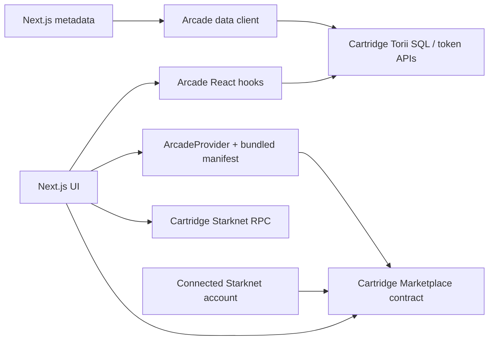
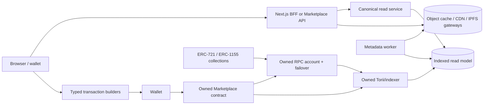

# Owned Marketplace Infrastructure Migration Scope

Status: Proposed

Date: July 11, 2026

Target: `BibliothecaDAO/marketplace`

Migration: Cartridge-managed marketplace contract, data client, indexers, and RPC path to Bibliotheca-owned infrastructure

> **Immediate operational warning:** On July 11, 2026, the SDK's default `https://api.cartridge.gg/x/arcade-main/torii` endpoint and its `/graphql` and `/sql` paths all responded with HTTP 410 and a message that the deployment was deprecated and scaled down. The mainnet marketplace contract still resolves on-chain to the class hash in the pinned manifest. Recovery of the legacy read model should start immediately; do not wait for the new protocol build.

## 1. Executive decision

This migration is a protocol and data-platform replacement, not an SDK swap.

The recommended path is:

1. Define a Bibliotheca-owned marketplace domain interface inside this frontend.
2. Put the existing Cartridge integration behind a temporary legacy adapter.
3. Build a clean-room, compatibility-first Starknet marketplace contract and typed transaction package.
4. Run an owned indexer, metadata pipeline, read API, and RPC configuration.
5. Integrate the new stack in shadow mode, then direct all new writes to the owned contract.
6. Require users to relist and recreate offers; archive legacy activity rather than pretending active orders can be moved.
7. Remove `@cartridge/arcade` and every runtime request to `api.cartridge.gg` after the cutover window.

The existing Cartridge wallet connector may remain during this migration if product wants it. Wallet connection is separable from marketplace infrastructure and should not hold up the protocol cutover.

### Why this route

- The default `arcade-main` Torii endpoint used for order, listing, and fee reads returned HTTP 410 during this review. Legacy read-model recovery is already an operational need.
- The UI imports Cartridge marketplace types or clients in 18 production files and 13 test files. Reads, transaction building, fees, royalties, freshness checks, metadata, portfolio data, and ops status all cross that boundary.
- `@cartridge/arcade@0.3.14-preview.1` builds its edge reads against Cartridge Torii SQL endpoints and its Dojo mode against Cartridge-owned Torii/RPC configuration. Changing `NEXT_PUBLIC_MARKETPLACE_DEFAULT_PROJECT` does not make the transport owned or configurable. See the pinned SDK's [edge client](https://github.com/cartridge-gg/arcade/blob/v0.3.14-preview.1/packages/arcade-ts/src/marketplace/client.edge.ts), [Torii SQL transport](https://github.com/cartridge-gg/arcade/blob/v0.3.14-preview.1/packages/arcade-ts/src/modules/torii-sql-fetcher.ts), and [runtime configuration](https://github.com/cartridge-gg/arcade/blob/v0.3.14-preview.1/packages/arcade-ts/src/configs/index.ts).
- The application bypasses the SDK for list, offer, cancel, and checkout calldata. Those calls are coupled to Cartridge's contract ABI and manifest.
- A new contract has different state and approvals. Existing sellers did not call the new contract, and ERC-20/ERC-721 approvals point at the old contract. Active listings and offers therefore cannot be trustlessly copied into the new contract.
- Cartridge's repositories are visible but are not permissively licensed for unrestricted commercial reuse. The checked-in [Cartridge license](https://github.com/cartridge-gg/marketplace/blob/main/LICENSE) applies a non-commercial restriction and a monthly-active-user condition. Legal review or written permission is a hard gate before copying or deriving from that implementation. Dojo/Torii are Apache-2.0 and OpenZeppelin Cairo Contracts are MIT, so those are viable building blocks for an independently implemented protocol.

## 2. Definition of “off Cartridge marketplace”

The migration is complete only when all of these are true in production:

- Own contract: all list, offer, cancel, accept, buy, validity, fee, and royalty behavior targets a Bibliotheca-controlled contract address.
- Own reads: collections, tokens, balances, traits, orders, listings, offers, activity, and aggregate market data come from a Bibliotheca-controlled API/indexer path.
- Own configuration: chain, RPC, contract addresses, supported collections, currencies, fees, and indexer endpoints are explicit and chain-aware.
- Own operations: Bibliotheca owns deployment keys, multisig roles, alerting, dashboards, backups, reindexing, and incident runbooks.
- No Arcade runtime: `@cartridge/arcade` is absent from runtime and test dependencies.
- No Cartridge data/RPC calls: application traffic has no `api.cartridge.gg` read, image, SQL, GraphQL, Torii, or Starknet RPC requests.

Not automatically included:

- Removing `@cartridge/connector` and Controller wallets. Keep or remove this through a separate wallet decision.
- If Controller remains, its built-in inventory marketplace must not become an implicit fallback path: upstream Controller inventory is separately wired to Arcade's mainnet manifest and fee configuration even though this application does not call that path today.
- Running a full Starknet node. The RPC can be an account Bibliotheca owns with a non-Cartridge provider, with failover, before self-hosting a node is justified.
- Redesigning marketplace UI. Existing shadcn/Tailwind surfaces remain the presentation layer.

## 3. Current-state architecture



### 3.0 Legacy recovery anchors

| Item | Pinned value |
| --- | --- |
| Arcade package | `@cartridge/arcade@0.3.14-preview.1` |
| Source commit | `c0355bcd142627d06fb639fd7bf3ea8b57f80d64` |
| Namespace | `ARCADE` |
| Mainnet World | `0x7a079295990e43441a7389fdc3b9ba063c6cd6aee16fb846f598c42a9f04ff7` |
| Mainnet Marketplace | `0x6bbf16b6c67b1bef27a187b499b2f3a14af31646c2c90d64f11b9087c3f527c` |
| Mainnet marketplace class hash | `0x58fcd599b5037e899a479324dc5d09d46db2640d0587a41259ef3db0c95b858` |
| Sepolia Marketplace | `0x7669aff1a265088243875225d97628bcf69a9f123f44a1987546a99ee5b6e98` |
| Default order/fee data project | `arcade-main` |
| Order minimum lifetime | 28,800 seconds (eight hours) |

These values are recovery inputs, not target-owned deployment choices. Validate them against chain and the content-addressed source before replay.

### 3.1 Read dependency inventory

| Product capability | Current source | Required replacement |
| --- | --- | --- |
| Collection summary | `useMarketplaceCollection` / `getCollection` | `getCollection` API and canonical collection model |
| Paginated tokens | `fetchCollectionTokens` | Keyset-paginated token API |
| Token detail | `useMarketplaceToken` with multiple ID fallbacks | Canonical token lookup accepting decimal/hex input |
| Listings | `useMarketplaceCollectionListings` | Active listing projection with indexed and on-chain validity metadata |
| Orders/activity | `useMarketplaceCollectionOrders` | Order and immutable activity endpoints |
| Ownership/portfolio | `fetchTokenBalances` | Owned balance/ownership projection |
| Trait names/values | Arcade SQL helpers | Normalized token attributes plus aggregate trait queries |
| Fee config | Arcade `Book` projection | Contract-backed fee configuration/quote endpoint |
| Royalty estimate | `royalty_info` through SDK provider | Contract quote using the exact settlement rules |
| SEO metadata | Server-created Arcade client | Server-side owned API client with cache policy |
| Images | Torii static URLs or token metadata | Owned metadata cache and image/IPFS gateway policy |
| Ops state | Arcade client initialization state | API, indexer lag, RPC, contract, metadata, and transaction health |

### 3.2 Write dependency inventory

| User action | Current implementation | Coupling to remove |
| --- | --- | --- |
| List | UI builds `set_approval_for_all` + `list` calldata | Hard-coded contract and ABI; unsafe numeric price parsing |
| Make offer | UI builds `offer` calldata | Hard-coded contract and ABI; no explicit ERC-20 approval in the action |
| Cancel | UI calls `cancel` directly | Hard-coded contract and order key semantics |
| Buy one or many | Cart builds one ERC-20 `approve` plus N `execute` calls | Manifest introspection, Cartridge validity call, duplicated ABI encoding |
| Validate cart | Indexed listing comparison plus Arcade `getValidity` | Two independently shaped sources with permissive runtime parsing |
| Fee routing | Hard-coded 500 bps plus SDK fee receiver/fallback receivers | Protocol fee and client fee are conflated |

### 3.3 Direct evidence in this repository

- [`src/lib/marketplace/config.ts`](../src/lib/marketplace/config.ts) types the whole runtime as `MarketplaceClientConfig` and exposes project/runtime settings, but no owned API, Torii, RPC, marketplace address, or metadata endpoint.
- [`src/lib/marketplace/starknet-config.ts`](../src/lib/marketplace/starknet-config.ts) hard-codes `https://api.cartridge.gg/x/starknet` as the wallet RPC.
- [`src/components/providers/marketplace-provider.tsx`](../src/components/providers/marketplace-provider.tsx) globally requires `MarketplaceClientProvider`.
- [`src/lib/marketplace/hooks.ts`](../src/lib/marketplace/hooks.ts) delegates all collection, token, order, listing, trait, balance, and portfolio reads to Arcade.
- [`src/features/token/token-detail-view.tsx`](../src/features/token/token-detail-view.tsx) hard-codes a marketplace contract and manually creates list, offer, and cancel calldata.
- [`src/features/cart/components/cart-sidebar.tsx`](../src/features/cart/components/cart-sidebar.tsx) instantiates `ArcadeProvider`, reads its manifest, queries Arcade listings/fees/royalties, calls Arcade validity, and manually creates checkout calldata.
- [`src/lib/marketplace/seo-data.ts`](../src/lib/marketplace/seo-data.ts) dynamically loads Arcade on the server, so removing the React provider alone would leave a production dependency.
- [`tests/e2e/purchase-funnel.spec.ts`](../tests/e2e/purchase-funnel.spec.ts) stops at add-to-cart and conditionally skips when live data is unavailable. It does not prove list, offer, buy, cancel, settlement, or indexer convergence.

## 4. Review findings that must shape the migration

These are migration risks and design requirements. They are not a request to patch the legacy path independently of the migration.

### Critical

#### C0. The default hosted legacy order/indexer path is unavailable

The pinned edge client reads order, listing, fee, and book state from the default `arcade-main` Torii project. Direct checks on July 11, 2026 returned HTTP 410 from its root, GraphQL, and SQL paths. Collection-specific token projects may have different availability, but they do not restore the default orderbook path.

Exit condition: archive the exact ABI/manifests/model definitions, run a compatible self-hosted legacy Torii/indexer against the old Arcade World, locate its deployment block, replay `Book`, `Order`, `Listing`, `Offer`, and `Sale`, and reconcile current orders against on-chain validity. Cancellation has no dedicated marketplace event in the pinned implementation; it is a Dojo model mutation, so prove that the selected replay path recovers cancellations rather than relying on sale/listing events alone. Treat this as recovery work, not a future optimization.

#### C1. Repository visibility does not grant unrestricted reuse

The upstream Cartridge marketplace/Arcade root license is source-available with non-commercial conditions, not MIT/Apache-style permission. The package metadata also describes the TypeScript package as MIT, creating a material ambiguity that this scope cannot resolve. Do not fork, rename, deploy, or copy implementation code until counsel or Cartridge confirms permission in writing. The clean-room path must work from an independently authored product/contract specification and permissively licensed dependencies.

Exit condition: an approved licensing decision is recorded before protocol implementation starts. If clean-room development is required, counsel also approves the separation between source-review/spec authors and implementers; “rewrite it while looking at the code” is not a clean-room process.

#### C2. Money and IDs are not lossless end-to-end

The pinned Arcade `OrderModel` converts order IDs, token IDs, quantities, and u128 prices to JavaScript `number`; the app also uses `parseFloat * 1e18` for user-entered prices. Wei-denominated amounts routinely exceed JavaScript's safe integer range.

Exit condition: every address, token ID, order ID, quantity, price, fee amount, royalty amount, and balance crosses JSON as a canonical string and becomes `bigint` only inside math/calldata modules. No atomic amount accepts `number`; bounded configuration such as basis points may use an integer type.

#### C3. Fees shown, approved, and routed do not share one source of truth

The cart labels a hard-coded 500 bps client fee as “Marketplace Fee,” adopts the SDK protocol fee receiver as the client-fee receiver when available, and adds royalty to buyer approval/total. The referenced legacy contract charges client fee on top while protocol fee and royalty are taken from settlement proceeds. Token detail calculates a different total. This can overstate required balance, over-approve currency, and route revenue unexpectedly.

Exit condition: the new contract exposes a deterministic execution quote, and the UI/API use that quote for display, balance checks, allowance, and execution. A conservation invariant proves buyer debit equals seller proceeds plus all fees.

#### C4. The write path is ABI-coupled and chain-fragile

Token actions hard-code a contract address while checkout discovers one from a bundled Arcade manifest. The pinned SDK's committed mainnet and Sepolia manifests contain different marketplace addresses, and its provider configuration imports the mainnet manifest for both configured chains. This is not a safe source of chain truth.

Exit condition: one validated deployment manifest maps `chainId -> contract address + class hash + ABI version`; generated transaction builders are the only code allowed to encode calls.

#### C5. Legacy offer execution accepts fee terms not committed by the maker

This is an inference from the pinned contract source and must be validated by the protocol/security review: buy-order execution accepts `client_fee` and `client_receiver` from the executing seller, permits a client fee up to the denominator, and inflates the buyer payment by that fee. Those terms are not fields in the buyer's stored order. A buyer with excess balance/allowance could therefore be charged an unintended taker-selected fee. See the pinned [buy execution](https://github.com/cartridge-gg/arcade/blob/c0355bcd142627d06fb639fd7bf3ea8b57f80d64/packages/orderbook/src/components/buyable.cairo#L173-L250) and [fee validation](https://github.com/cartridge-gg/arcade/blob/c0355bcd142627d06fb639fd7bf3ea8b57f80d64/packages/orderbook/src/models/book.cairo#L91-L122).

Exit condition: the owned protocol derives fees from contract configuration or terms committed by the paying maker, enforces a signed maximum debit, and never lets a taker choose an unbounded receiver/fee at execution.

### High

#### H1. Royalty estimates silently collapse to zero

Arcade's `getRoyaltyFee` requires an RPC provider. The app's SDK config does not pass one, and UI callsites catch failures and use zero. The resulting UI can report a successful-looking zero rather than “unavailable.”

Exit condition: quote responses distinguish `supported`, `not-supported`, and `unavailable`; checkout fails closed if the contract and displayed quote disagree.

#### H2. Active state cannot be migrated by database copy

Listings and offers are owned by their on-chain caller and rely on approval/allowance to a specific spender contract. A database backfill can preserve history but cannot create valid new orders or move user approvals.

Exit condition: cutover includes relist/reoffer UX, legacy cart invalidation, and optional approval-revocation guidance.

#### H3. Transaction construction lives in large UI components

Cart and token detail contain ABI layout, u256 encoding, fee selection, validity parsing, and contract discovery. This makes protocol review difficult and lets display behavior drift from settlement behavior.

Exit condition: UI calls typed intents such as `buildListCalls`, `buildOfferCalls`, `buildCancelCalls`, and `buildCheckoutCalls`; those builders have fixture tests against the deployed ABI.

#### H4. Existing test coverage does not exercise financial integration

Unit tests mock the SDK/provider/account. Playwright tests can skip based on live data and never sign or settle transactions.

Exit condition: deterministic local-chain tests and a seeded Sepolia suite execute the full lifecycle and wait for both chain receipt and indexer convergence.

#### H5. Current offer/expiration controls violate the pinned contract rules

The UI offers a one-hour expiry although the pinned orderbook requires a minimum eight-hour lifetime. It defaults offer quantity to `1`, while the pinned ERC-721 validity rule requires its quantity sentinel to be `0`. The offer action also omits an ERC-20 approval even though order creation checks balance and allowance. These paths can fail before any migration begins.

Exit condition: the domain contract specification defines human-facing quantity/expiry semantics, builders adapt them to the ABI, and local-chain tests cover every UI preset and supported asset standard.

#### H6. The legacy validity helper is not execution-complete

The pinned `get_validity` helpers check expiry, ownership/balance, and approval, but do not check order status or the global pause state. A cancelled order can still return `true` if its asset state has not changed. The cart currently treats this helper as one of its pre-signing authorities, so merely reproducing its response in the owned API would preserve a stale-order bug. See the pinned [sell validity helper](https://github.com/cartridge-gg/arcade/blob/c0355bcd142627d06fb639fd7bf3ea8b57f80d64/packages/orderbook/src/components/sellable.cairo#L242-L269) and [buy validity helper](https://github.com/cartridge-gg/arcade/blob/c0355bcd142627d06fb639fd7bf3ea8b57f80d64/packages/orderbook/src/components/buyable.cairo#L259-L290).

Exit condition: owned quote/validity checks include placed status, remaining quantity, expiry, pause state, ownership/balance, approvals/allowance, immutable order terms, and exact fee policy, with a machine-readable reason for every failure.

### Medium

#### M1. Browser reads have no owned API boundary

The SDK issues Torii queries directly. That prevents server-side credentials, consistent rate limits, schema versioning, response validation, and central observability.

Exit condition: browsers use an owned, allowlisted API/BFF surface; raw SQL is never a public client interface.

#### M2. Freshness has no explicit watermark

Indexed results do not tell the UI which block they represent or how far they lag chain head. Checkout compensates with an on-chain check but browse and fee states cannot explain staleness.

Exit condition: read responses include indexed block, chain head, finality, lag, and observed timestamp; ops and checkout use them.

#### M3. Order identity lacks a source namespace

Persisted cart rows use `orderId` alone. A new contract can issue the same numeric IDs as the legacy contract.

Exit condition: define an `OrderKey` containing chain ID, marketplace address, and order ID. If product insists that row identity remain `orderId`, legacy carts must be forcibly versioned out and only one contract may be cartable at a time.

## 5. Recommended target architecture



### 5.1 Ownership boundaries

- Chain remains the source of truth for orders, ownership, balances, fees, and settlement.
- The indexer is a rebuildable projection, never an authority that can authorize purchases.
- The API is a stable product contract and validation layer, not a second orderbook.
- The browser signs direct Starknet transactions; backend custody or relaying is out of scope for P0.
- Metadata is cached and normalized, but raw token URI and content hash/source remain traceable.
- Contract administration is controlled by a multisig, with roles and emergency actions documented.

### 5.2 Repository/package boundaries

The exact repository split is a team decision, but the ownership boundaries should be explicit:

- `marketplace-protocol`: Cairo contract, generated ABI, deployment manifests, contract tests, audit artifacts.
- `marketplace-data`: indexer/Torii config, metadata worker, migrations, reconciliation, API, runbooks.
- `marketplace-client`: shared domain schemas and generated/hand-reviewed transaction builders, publishable internally.
- This repository: product UI, query hooks, cart state, wallet execution, SEO, and ops surface.

A monorepo is acceptable if these remain separate packages with independent tests and release versions.

## 6. Protocol scope

### 6.1 Required P0 behavior

- ERC-721 fixed-price listing, cancel, stale removal, and purchase.
- Offers: create, cancel, validate, and accept. Existing UI already exposes offer creation, so a one-way offer path is not acceptable.
- Multi-currency settlement for STRK, LORDS, and SURVIVO through a chain-aware allowlist.
- Optional ERC-2981 royalties, quoted and settled in the listing currency.
- Explicit protocol fee and optional client/referral fee policy.
- Fee terms charged to an order maker are contract-configured or committed into that maker's order, including a maximum debit and permitted receiver semantics.
- Per-order expiration and status: `placed`, `cancelled`, `executed`, and an indexed `invalid` projection for expired/approval/ownership failures.
- On-chain single and batch validity views with machine-readable reason codes.
- Atomic cart compatibility. One account transaction must either buy every selected row or buy none.
- Pause/resume and role-controlled fee/currency/collection administration.
- Explicit creation, cancellation, partial-fill, full-fill, and administration/configuration events sufficient to reconstruct the complete order and sale lifecycle from genesis without interpreting opaque storage mutations.

ERC-1155 support is a P0 decision gate. Implement it in P0 if any launch collection uses it or if protocol parity is required; otherwise design the order schema to add it without changing ERC-721 keys and ship it after cutover.

### 6.2 Required contract interfaces

Names are illustrative; the contract specification owns final ABI names.

- `list(collection, token_id, quantity, unit_price, currency, expiration, royalties)`
- `offer(collection, token_id, quantity, unit_price, currency, expiration)`
- `cancel(order_key)`
- `remove_invalid(order_key)`
- `execute(order_key, asset_id, quantity, fee_context)`
- `execute_batch(items, fee_context)` or documented account-multicall equivalence
- `get_order(order_key)`
- `get_validity(order_key) -> (valid, reason)`
- `get_validities(order_keys)`
- `quote(order_key, quantity, fee_context) -> ExecutionQuote`
- Administration for pause, roles, supported collections/currencies, fee schedule, and upgrade policy

### 6.3 Contract invariants

- No order can execute when expired, cancelled, filled, under-approved, underfunded, or no longer owned.
- The caller cannot buy its own sell listing.
- An ERC-721 order always transfers exactly one token; UI `quantity=0` compatibility must not leak into the domain model.
- No settlement amount uses floating point or a type narrower than the supported token amount.
- `buyer debit = seller proceeds + protocol fee + client fee + royalty` for every successful sale.
- Total fees cannot exceed the configured cap or sale amount.
- A taker cannot alter the paying maker's fee basis points, receiver, royalty choice, or maximum debit.
- State is updated before untrusted token receiver callbacks, with reentrancy protection where needed. OpenZeppelin documents that safe ERC-721/ERC-1155 transfers can yield to receivers and create reentrancy risk; use checks-effects-interactions and a guard. See [OpenZeppelin Cairo security](https://docs.openzeppelin.com/contracts-cairo/3.x/security), [ERC-721](https://docs.openzeppelin.com/contracts-cairo/3.x/api/erc721), and [ERC-1155](https://docs.openzeppelin.com/contracts-cairo/3.x/api/erc1155).
- Pausing blocks value-moving and order-creation actions according to a written incident policy; cancellation should remain available unless the threat model says otherwise.
- Every administrative action emits an event.
- Upgrade authorization, delay, and rollback are explicit. A multisig alone is not an upgrade policy.

### 6.4 Contract delivery gates

- Independently authored specification reviewed by product, protocol, frontend, data, and security owners.
- Unit tests for every transition and error.
- Stateful fuzz/invariant tests for balances, fees, order status, repeated execution, partial quantity, expiration, and malicious receiver/token behavior.
- Local Katana/devnet lifecycle suite.
- Sepolia deployment with reproducible class hash and manifest.
- Independent security audit; no unresolved critical/high issues at mainnet launch.
- Multisig role ceremony and emergency drill completed before mainnet writes.

## 7. Indexer, metadata, and API scope

### 7.1 Indexer

Recommended P0: self-host Torii or another owned, replayable Starknet event indexer. Torii is Apache-2.0, can index Dojo state and external token contracts, and exposes metrics; see the [Torii repository](https://github.com/dojoengine/torii). The final choice must be proven against every configured collection and the target contract before commitment.

Required behavior:

- Index the owned marketplace contract from its deployment block.
- Index transfers/balances for every supported ERC-721 and P0 ERC-1155 collection.
- Index currency metadata needed by the product.
- Store block number, block hash, transaction hash, event index, finality, and canonical status.
- Resume idempotently from checkpoints after restart.
- Detect/recover from reorgs and reconcile projections against chain reads.
- Expose indexer head and lag. Starknet distinguishes pre-confirmed, accepted-on-L2, and accepted-on-L1 transaction states; product and operators must know which state they are showing. See [Starknet transaction statuses](https://docs.starknet.io/learn/protocol/transactions).
- Support full replay into an empty database and a documented backup/restore path.

### 7.2 Canonical read model

Minimum entities:

- `collections`
- `tokens`
- `token_attributes`
- `token_balances` / current ownership
- `orders`
- `order_events`
- `sales`
- `currencies`
- `fee_configuration_history`
- `metadata_fetches` and failures
- `indexer_checkpoints`

Minimum keys:

- Chain-scoped addresses.
- Token: `(chain_id, collection_address, token_id)`.
- Order: `(chain_id, marketplace_address, order_id)` plus collection/token fields for validation and query indexes.
- Event: `(chain_id, transaction_hash, event_index)`.

All on-chain integers are stored losslessly as numeric/decimal database values and serialized as decimal strings.

### 7.3 Metadata pipeline

- Resolve contract metadata and token URI without trusting one gateway.
- Support HTTP(S), IPFS, and known on-chain metadata shapes.
- Apply response size, MIME, redirect, and timeout limits.
- Cache original metadata, normalized metadata, fetch status, source URI, and content hash.
- Normalize attributes into queryable trait name/value rows while retaining the raw payload.
- Use owned object storage/CDN for cached images or proxy through a hardened image service.
- Retry transient failures with bounded backoff; quarantine permanent parse/security failures.
- Provide refresh with authorization/rate limits and record provenance.
- Backfill every launch collection and publish success/failure counts before cutover.

### 7.4 Product API/BFF

Do not expose raw Torii SQL to the browser. Provide allowlisted, versioned endpoints or equivalent typed procedures:

- `GET /v1/collections`
- `GET /v1/collections/:address`
- `GET /v1/collections/:address/tokens`
- `GET /v1/collections/:address/traits`
- `GET /v1/collections/:address/orders`
- `GET /v1/collections/:address/listings`
- `GET /v1/tokens/:collection/:tokenId`
- `GET /v1/tokens/:collection/:tokenId/activity`
- `GET /v1/portfolio/:account`
- `POST /v1/orders/validate`
- `POST /v1/orders/quote`
- `GET /health`, `GET /ready`, and an authenticated operational sync endpoint

API requirements:

- Runtime schema validation for requests and responses.
- Opaque keyset cursors; no offset cursor contract.
- Explicit sort semantics and stable tie-breakers.
- Chain, marketplace address, schema version, indexed block, chain head, and lag in response metadata.
- Cache policy per resource, ETag/conditional support where useful, request IDs, rate limits, and structured errors.
- No private RPC/API credentials in `NEXT_PUBLIC_*` variables.
- Server-side SEO calls use the same API client as browser-facing features.

## 8. Frontend migration scope

### 8.1 Introduce the domain seam first

Create strict, project-owned types under `src/lib/marketplace/domain` or a shared internal package. No feature/UI file may import a vendor marketplace type.

Example shape:

```ts
type ChainAddress = string;
type AtomicAmount = string;
type TokenId = string;
type OrderId = string;

type OrderKey = {
  chainId: string;
  marketplace: ChainAddress;
  orderId: OrderId;
};

type MarketplaceOrder = {
  key: OrderKey;
  category: "buy" | "sell";
  status: "placed" | "cancelled" | "executed" | "invalid";
  collection: ChainAddress;
  tokenId: TokenId;
  owner: ChainAddress;
  currency: ChainAddress;
  unitPrice: AtomicAmount;
  quantity: AtomicAmount;
  expiresAt: string;
};
```

Define a frontend-facing gateway with collection, token, trait, listing, order, portfolio, validity, and quote methods. Implement two adapters temporarily:

- `LegacyCartridgeMarketplaceAdapter`: contains every remaining Arcade dependency.
- `OwnedMarketplaceAdapter`: consumes the owned API and typed contract package.

The rest of the app must depend only on the gateway and domain types.

### 8.2 Transaction package

Move all ABI behavior out of React components:

- Decimal-string amount parsing using currency decimals.
- Chain-aware deployment resolution.
- Generated ABI calldata for list, offer, cancel, accept, buy, and batch checkout.
- Allowance/approval planning for ERC-20 and collection operators.
- Exact fee quote consumption.
- Error decoding into stable product error codes.
- Call fixtures asserted against the deployed class/ABI version.

Components should provide intent and render state; they should not know felt ordering or u256 low/high layout.

### 8.3 Query/provider changes

- Replace `MarketplaceClientProvider` with a project-owned provider exposing gateway readiness and source/version.
- Replace Arcade hooks in `src/lib/marketplace/hooks.ts` with TanStack Query hooks over the owned gateway.
- Preserve current query states and URL behavior.
- Eliminate multiple token-ID probe requests by canonicalizing at the API boundary.
- Use API response freshness metadata in browse, detail, and checkout UI.
- Update SEO data, trait prefetch, portfolio, wallet ownership, collection stats, market activity, and ops status.

### 8.4 Cart migration

- Create a persisted cart schema v2 with `OrderKey`, contract address, chain ID, quote version, and currency decimals.
- Do not reinterpret a v1 Cartridge order ID as a new-contract order.
- Recommended cutover behavior: clear/quarantine v1 rows with a one-time explanation and relist/re-add action.
- Preserve the 25-item cap, single-currency checkout, strict all-row validation, one-transaction execution, and inline per-row errors.
- Validate all rows in one request/on-chain batch where possible.
- Compare the quote immediately before signing and show which row changed.

### 8.5 Ops surface

Replace “Arcade client ready” with:

- active chain and deployment manifest version
- RPC primary/fallback health
- API readiness and schema version
- indexer head, chain head, lag, and last event time
- metadata backlog/failure count
- contract pause state and fee schedule
- supported collections/currencies
- last quote/validity diagnostic ID, without leaking wallet-private data

## 9. Migration and cutover strategy

### 9.1 What can be migrated

| Data/state | Strategy |
| --- | --- |
| Collections | Import registry/config, validate contract standard, backfill metadata |
| Tokens and traits | Reindex from chain/token URI; reconcile counts and samples |
| Current ownership | Reindex transfers/balances and compare with sampled on-chain reads |
| Historical orders/sales | Export as source-labelled legacy activity, or link to legacy explorer/API archive |
| SEO URLs | Keep existing routes and swap their data source |
| Active listings | Cannot be copied as active; seller must approve and list on the new contract |
| Active offers | Cannot be copied as active; maker must approve and recreate on the new contract |
| User approvals | Cannot be transferred; prompt approval for new contract and optionally help revoke old approvals |
| Persisted carts | Version out; never remap by numeric order ID |

### 9.2 Cutover modes

Choose after measuring active legacy listing/offer count, value, and weekly volume.

#### Preferred: hard write cutover

1. Announce the contract change and relisting date.
2. Freeze new legacy list/offer actions in this UI.
3. Keep legacy activity and listings visible as non-cartable/read-only records.
4. Enable new-contract listing/offer actions.
5. Clear legacy carts and guide users to approve/relist/reoffer.
6. Direct all purchases to the owned contract.

This has the smallest trust and implementation surface.

#### Conditional: dual-protocol purchase window

Keep old listings buyable for a short, explicit window only if legacy liquidity is material. Every order must show its source; carts cannot mix contracts; transaction builders and validation stay source-specific. This delays full independence and adds collision, fee, support, and security risk.

Do not implement a dual window by silently merging numeric order IDs.

### 9.3 Rollback

- Before mainnet writes: switch reads back to legacy adapter.
- After new mainnet orders exist: never route those order IDs to the legacy contract. Rollback means pause new writes if authorized, keep new state readable, and remediate; it is not a database toggle.
- Maintain immutable deployment manifests and source-labelled order keys.
- Practice RPC failover, indexer replay, API rollback, and contract pause before launch.

## 10. Phased work breakdown

### Phase 0 — Decisions, legal, and baseline (1 week)

| ID | Deliverable | Exit evidence |
| --- | --- | --- |
| DEC-01 | Define exactly which Cartridge services leave and whether Controller wallet remains | Signed architecture decision |
| DEC-02 | License review for Cartridge source/package and clean-room rules | Written legal/maintainer approval |
| DEC-03 | Inventory production collections, standards, deployment blocks, metadata sources, currencies | Versioned registry |
| DEC-04 | Decide fee incidence, basis points, receivers, royalty policy, and referral/client fee | Product + finance decision |
| DEC-05 | Decide upgradeability, multisig, timelock, pause policy, and supported token allowlists | Security ADR |
| REC-00 | Recover the unavailable legacy `arcade-main` read model with a compatible self-hosted indexer | Replayed models, current-order validity reconciliation, immutable snapshot |
| REC-01 | Archive pinned ABI, manifests, class hashes, namespaces, model/event schemas, and legacy endpoint responses | Content-addressed recovery bundle |
| BASE-01 | Capture legacy active orders/offers, volume, latency, error rate, and query count | Baseline report in `.context/` or observability system |

### Phase 1 — Frontend anti-corruption layer (1–2 weeks)

| ID | Deliverable | Exit evidence |
| --- | --- | --- |
| FE-01 | Project-owned marketplace domain types and runtime schemas | Type and schema tests |
| FE-02 | Gateway interface and legacy adapter | Existing UI green through adapter |
| FE-03 | Remove vendor types from components/features | Static scan outside adapter is zero |
| FE-04 | Lossless amount/token/order utilities | Boundary/property tests above `2^53` |
| FE-05 | Extract typed transaction intent/building seam | Current ABI fixture tests |
| FE-06 | Cart storage v2 migration plan and source-aware order key | Store migration tests |

This phase can ship while legacy infrastructure is still live and materially reduces later cutover risk.

### Phase 2 — Owned protocol (3–5 engineering weeks plus audit lead time)

| ID | Deliverable | Exit evidence |
| --- | --- | --- |
| PROTO-00 | Establish the counsel-approved clean-room process and independently authored behavioral specification | Contributor/source-access record and approved protocol spec |
| PROTO-01 | Independently authored contract PRD, state machine, ABI, event, fee, and threat-model specs | Cross-functional sign-off |
| PROTO-02 | Core list/cancel/remove/execute implementation | Unit and transition tests |
| PROTO-03 | Offer/cancel/accept lifecycle | Full offer tests |
| PROTO-04 | Multi-currency, fee, and ERC-2981 settlement | Conservation/invariant tests |
| PROTO-05 | Batch validity, quote, and atomic checkout support | Cart-sized tests up to 25 rows |
| PROTO-06 | Roles, pause, supported currency/collection, and upgrade policy | Authorization tests |
| PROTO-07 | Malicious token/receiver, reentrancy, overflow, replay, and boundary tests | Fuzz/invariant report |
| PROTO-08 | Reproducible Sepolia deployment and generated typed package | Manifest + class hash + smoke results |
| PROTO-09 | Independent audit and remediation | No unresolved critical/high findings |
| PROTO-10 | Mainnet deployment ceremony | Signed release manifest and role record |

### Phase 3 — Owned data plane (3–4 weeks, parallel with Phase 2)

| ID | Deliverable | Exit evidence |
| --- | --- | --- |
| DATA-01 | RPC primary/fallback owned configuration | Failover test and budget/limit alerts |
| DATA-02 | Indexer/Torii proof for all launch collection standards | Backfill and live update report |
| DATA-03 | Marketplace projection and immutable event history | Replay test from empty storage |
| DATA-04 | Ownership/balance projection | Sampled on-chain reconciliation |
| DATA-05 | Metadata/trait worker and image policy | Backfill coverage/failure report |
| DATA-06 | Canonical API v1 with opaque cursors and freshness metadata | Contract tests/OpenAPI or equivalent |
| DATA-07 | Quote/validate endpoints backed by chain truth | Fixture and stale-order tests |
| DATA-08 | Metrics, tracing, alerts, backups, and runbooks | Restore and incident drill |
| DATA-09 | Legacy history export/archive | Count/hash reconciliation |

### Phase 4 — Owned frontend integration (2–3 weeks)

| ID | Deliverable | Exit evidence |
| --- | --- | --- |
| INT-01 | Owned read adapter and provider | Collection/token/listing parity tests |
| INT-02 | Owned transaction builders | Local and Sepolia lifecycle tests |
| INT-03 | Replace fee/royalty display with execution quote | Display/allowance/settlement equality tests |
| INT-04 | Replace validity/freshness flow | Per-row reason tests and batch validation |
| INT-05 | Migrate SEO, traits, profile/portfolio, activity, and ops | Route matrix green |
| INT-06 | Cart v2 and legacy-row quarantine | Persistence/cutover tests |
| INT-07 | Remove direct raw SDK parsing and `unknown` shape probing | Static review + strict types |
| INT-08 | Deterministic full-funnel e2e on local chain and Sepolia | CI artifacts with transaction hashes |

### Phase 5 — Shadow, launch, and decommission (2–3 weeks)

| ID | Deliverable | Exit evidence |
| --- | --- | --- |
| ROLL-01 | Shadow compare owned vs legacy tokens, ownership, traits, and legacy history | Threshold report; discrepancies resolved |
| ROLL-02 | Mainnet read-only smoke and synthetic operator checks | Launch checklist |
| ROLL-03 | Relist/reoffer communication and old-approval guidance | Reviewed UX/support copy |
| ROLL-04 | Hard cutover or approved dual-window implementation | Source-safe cutover tests |
| ROLL-05 | 24-hour and 7-day canary monitoring | SLO and reconciliation report |
| ROLL-06 | Remove `@cartridge/arcade`, project/runtime envs, manifests, and all Cartridge data/RPC URLs | Static and browser-network scan is zero |
| ROLL-07 | Archive migration evidence and close legacy operational access | Final runbook and ownership record |

## 11. Test and verification matrix

| Layer | Required coverage |
| --- | --- |
| Domain | Address/token/order normalization, decimal/hex equivalence, response schemas, lossless atomic amounts |
| Contract unit | Every state transition, permission, expiry, cancelled-status and paused-book validity, partial/full fill, ERC-721 and selected ERC-1155 semantics |
| Contract invariant | Conservation, single execution, bounded fees, no unauthorized transfer, pause/upgrade controls |
| Indexer | Idempotency, duplicate/out-of-order events, checkpoint resume, replay, reorg, lag, finality |
| Metadata | Malformed/oversized payloads, IPFS/HTTP failures, traits, redirects, MIME, retry/quarantine |
| API | Cursor stability, filtering/sorting, schema validation, errors, rate limits, freshness metadata |
| Frontend integration | Loading/empty/error/success, cart constraints, quotes, stale rows, ownership, offers, cancels |
| Local e2e | Mint → approve → list → browse → cart → buy → index → portfolio; offer → accept; cancel; stale order |
| Sepolia e2e | Same flow through deployed contract, owned RPC/API/indexer, waiting for accepted receipt and projection |
| Cutover | Legacy cart rejection, source-labelled history, no mixed-source cart, relist/reoffer, rollback controls |
| Security | Independent contract audit, API abuse review, metadata SSRF/content review, key/role review |
| Performance | Home, collection, token, portfolio p50/p95; API payloads; indexer lag; 25-row quote/checkout |

Required CI additions:

- Contract format/build/test/fuzz job pinned to toolchain.
- Generated ABI/client drift check.
- API schema and migration job.
- Local-chain integration job with deterministic fixtures.
- Existing frontend lint/typecheck/unit/build/e2e jobs.
- Dependency/license scan and secret scan.
- Mainnet deployment never runs from an unreviewed pull request.

## 12. Launch acceptance criteria

### Functional

- All configured collections render correct metadata, traits, ownership, listings, and activity.
- List, cancel, offer, cancel offer, accept offer, single purchase, and up-to-25-item atomic purchase work on supported wallets.
- STRK, LORDS, and SURVIVO quote, allowance, display, and settle with correct decimals and receivers.
- Expired, transferred, under-approved, cancelled, executed, or own listings cannot be bought.
- Cart still enforces one currency, maximum 25 rows, strict prevalidation, no partial fallback, and inline failures.

### Financial/security

- No JavaScript `number` enters an on-chain amount or identifier path.
- Quote and settlement match for buyer debit, seller proceeds, protocol/client fees, and royalty.
- No unresolved critical/high audit findings.
- Mainnet admin/upgrade/pause roles are controlled by approved multisig policy.
- Supported collection/currency behavior is explicit and tested against malicious contracts.

### Data/operations

- Indexed counts and sampled ownership/order state reconcile to chain at the agreed threshold.
- P95 indexer lag target is agreed and monitored; suggested launch target is at most two accepted L2 blocks during normal operation.
- Full replay, backup restore, RPC failover, and indexer restart have been demonstrated.
- Every API response and log can be traced by request/transaction identifier.
- Operators can see chain head, indexed head, lag, failure backlog, contract pause, and fee state.

### Independence

- `rg '@cartridge/arcade|api\.cartridge\.gg' src package.json pnpm-lock.yaml` returns no runtime integration. Lockfile-only transitive occurrences from an explicitly retained Controller wallet must be reviewed and documented.
- Browser network capture across the route and transaction matrix shows no Cartridge marketplace, Torii, asset, SQL, GraphQL, or RPC calls.
- New contract addresses and class hashes come only from the owned deployment manifest.
- Legacy orders are read-only/source-labelled or no longer shown; they are never executed through the owned adapter.

## 13. Effort and staffing

Planning range, not a commitment:

- With two protocol/backend engineers, one frontend engineer, and part-time DevOps/security: approximately 8–12 calendar weeks plus external-audit scheduling.
- With one engineer covering protocol, data, and frontend sequentially: approximately 16–24 weeks plus audit.
- The fastest safe route is an owned implementation with current product semantics, not a redesign of auction mechanics, custody, off-chain signatures, or cross-chain settlement.

Largest schedule risks:

1. License/clean-room decision.
2. Contract audit availability and remediation.
3. Metadata/indexing compatibility across every collection.
4. Undocumented fee and offer-product decisions.
5. Liquidity size determining whether a dual-protocol window is necessary.

## 14. Decision log required before execution

| Decision | Recommended default | Owner |
| --- | --- | --- |
| Retain Cartridge Controller wallet? | Yes for this migration; decouple later | Product/frontend |
| Protocol source strategy | Clean-room implementation unless written commercial permission exists | Legal/protocol |
| Order model | On-chain orderbook for compatibility | Product/protocol |
| Indexer | Owned Torii proof first; replace only if collection tests fail | Data/platform |
| API placement | Versioned BFF/API; no browser SQL | Platform/frontend |
| ERC-1155 at launch | Only if a launch collection needs it; preserve extension path | Product/protocol |
| Protocol/client fee incidence | One written quote/settlement model; no hidden hard-coded fee | Product/finance |
| Upgradeability | Multisig-controlled, explicit delay/policy, audited | Security/protocol |
| Legacy liquidity | Hard cutover unless measured value justifies dual window | Product/ops |
| Cart identity | Source-aware `OrderKey`; version out v1 storage | Frontend/product |
| RPC | Owned provider accounts with primary/fallback; self-host node later if justified | Platform |

## 15. Explicitly out of scope

- Custodial wallets or backend-signed user transactions.
- Cross-chain orders or settlement.
- Auctions, collection-wide bids, criteria orders, lending, rentals, or AMM mechanics unless separately specified.
- A new visual design system.
- Migrating active legacy orders by impersonating users or modifying contract state.
- Treating the index database as settlement authority.
- Copying Cartridge marketplace source before the license gate is cleared.

## 16. Primary sources

- Current repository: [`README.md`](../README.md), [`docs/SCOPE.md`](./SCOPE.md), [`docs/TDD-PRD.md`](./TDD-PRD.md), and the source files linked above.
- Pinned Arcade client API and types: [Marketplace types](https://github.com/cartridge-gg/arcade/blob/v0.3.14-preview.1/packages/arcade-ts/src/marketplace/types.ts), [edge client](https://github.com/cartridge-gg/arcade/blob/v0.3.14-preview.1/packages/arcade-ts/src/marketplace/client.edge.ts), [Dojo client](https://github.com/cartridge-gg/arcade/blob/v0.3.14-preview.1/packages/arcade-ts/src/marketplace/client.dojo.ts), and [React provider/hooks](https://github.com/cartridge-gg/arcade/blob/v0.3.14-preview.1/packages/arcade-ts/src/marketplace/react.tsx).
- Pinned Arcade contract ABI and manifests: [marketplace system](https://github.com/cartridge-gg/arcade/blob/v0.3.14-preview.1/contracts/src/systems/marketplace.cairo), [mainnet manifest](https://github.com/cartridge-gg/arcade/blob/v0.3.14-preview.1/manifest_mainnet.json), and [Sepolia manifest](https://github.com/cartridge-gg/arcade/blob/v0.3.14-preview.1/manifest_sepolia.json).
- License gate: [Cartridge marketplace license](https://github.com/cartridge-gg/marketplace/blob/main/LICENSE), [Arcade root license](https://github.com/cartridge-gg/arcade/blob/v0.3.14-preview.1/LICENSE), and the conflicting [`@cartridge/arcade` package license field](https://github.com/cartridge-gg/arcade/blob/v0.3.14-preview.1/packages/arcade-ts/package.json).
- Owned indexing option: [Dojo](https://github.com/dojoengine/dojo), [Torii](https://github.com/dojoengine/torii), [Torii overview](https://book.dojoengine.org/toolchain/torii), and [Torii production configuration](https://book.dojoengine.org/toolchain/torii/configuration). Dojo and Torii are Apache-2.0; the [raw Torii SQL interface](https://book.dojoengine.org/toolchain/torii/sql) is not the product API boundary.
- Contract building blocks: [OpenZeppelin Contracts for Cairo](https://docs.openzeppelin.com/contracts-cairo/3.x), MIT licensed.
- Chain receipt/finality model: [Starknet transaction documentation](https://docs.starknet.io/learn/protocol/transactions).
- Existing Bibliotheca candidates reviewed: [market](https://github.com/BibliothecaDAO/market), [onchain-nft-market](https://github.com/BibliothecaDAO/onchain-nft-market), and [starknet-indexer](https://github.com/BibliothecaDAO/starknet-indexer). These are useful historical references, but their current dependencies/toolchains do not satisfy this scope without substantial replacement.

## 17. Review limitations

- This is a static architecture, source, and test review. It is not a smart-contract security audit.
- No production metrics, active-order export, RPC account limits, deployment keys, or infrastructure inventory were available in this repository.
- The local `.env.local` is user-owned and was not changed; production collection configuration must be inventoried separately.
- No tests were run because this change adds documentation only and dependencies were not installed in the workspace.
